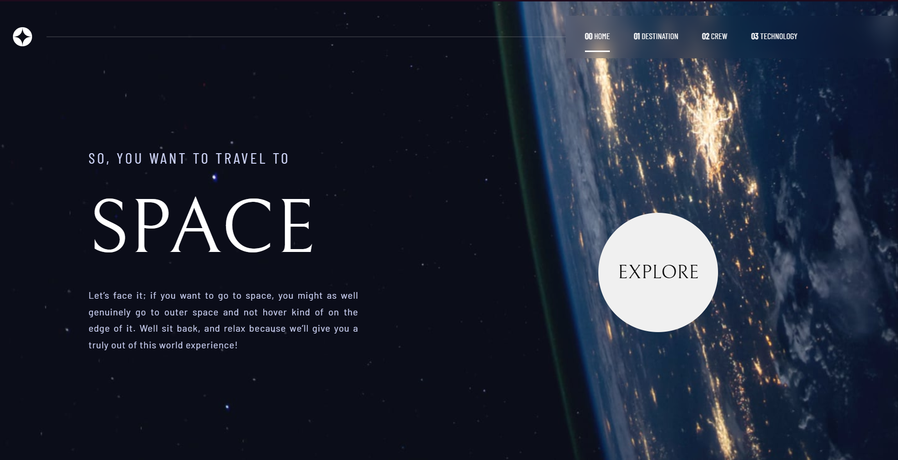

# Site [Space Tourism](https://kauavillan.github.io/space-tourism)

Este site foi baseado em um desafio do site [Frontend mentor](https://www.frontendmentor.io/challenges). Clique no link acima para visitá-lo.

## Conhecimentos adquiridos

Esse foi meu primeiro projeto pessoal criado em [Rect.js](https://pt-br.reactjs.org). Por conta disso, certamente ganhei muitos pontos de experiência sobre a biblioteca.

Além disso, também aprimorei minhas habilidades em:
* Javascript
* Css
* HTML
* Git/GitHub

## Sobre o Frontend Mentor
É um site que disponibiliza desafios que envolvem a criação de páginas voltadas para o frontend. Ele te dá arquivos com os textos utilizados, imagens de como o site deve ficar e, na maioria dos casos, uma lista com as fontes e cores que devem ser utilizadas (não é o caso desse projeto 😭). Fora isso, todo o trabalho é com você!

## Capturas de tela
Página inicial

Página Destination

Página Crew

Página Technology

[Clique aqui para ver mais detalhadamente 👆](https://kauavillan.github.io/space-tourism)
